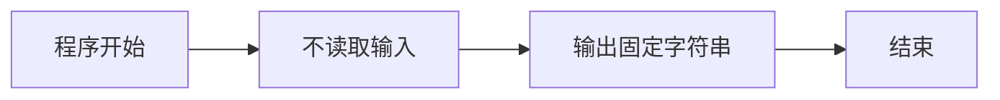
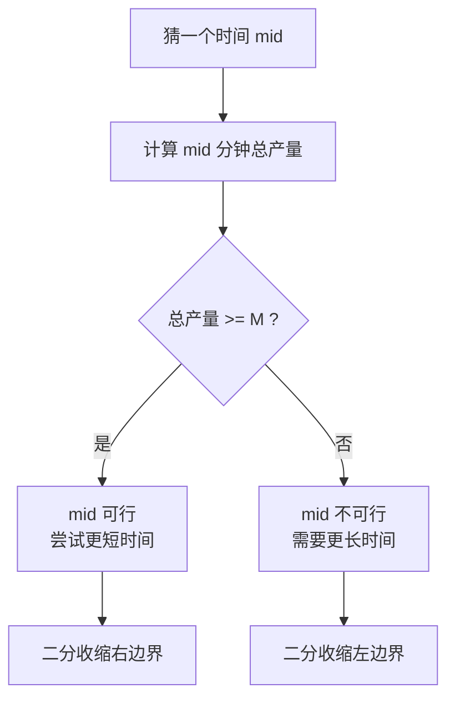
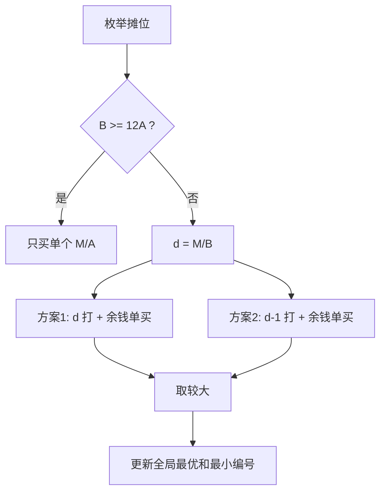
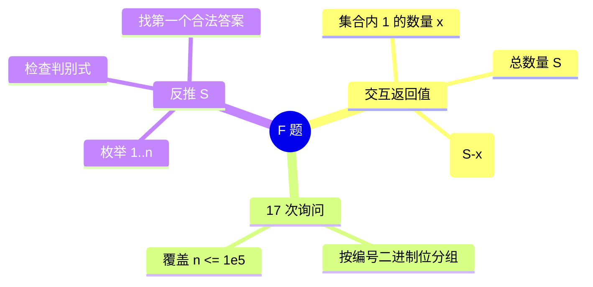
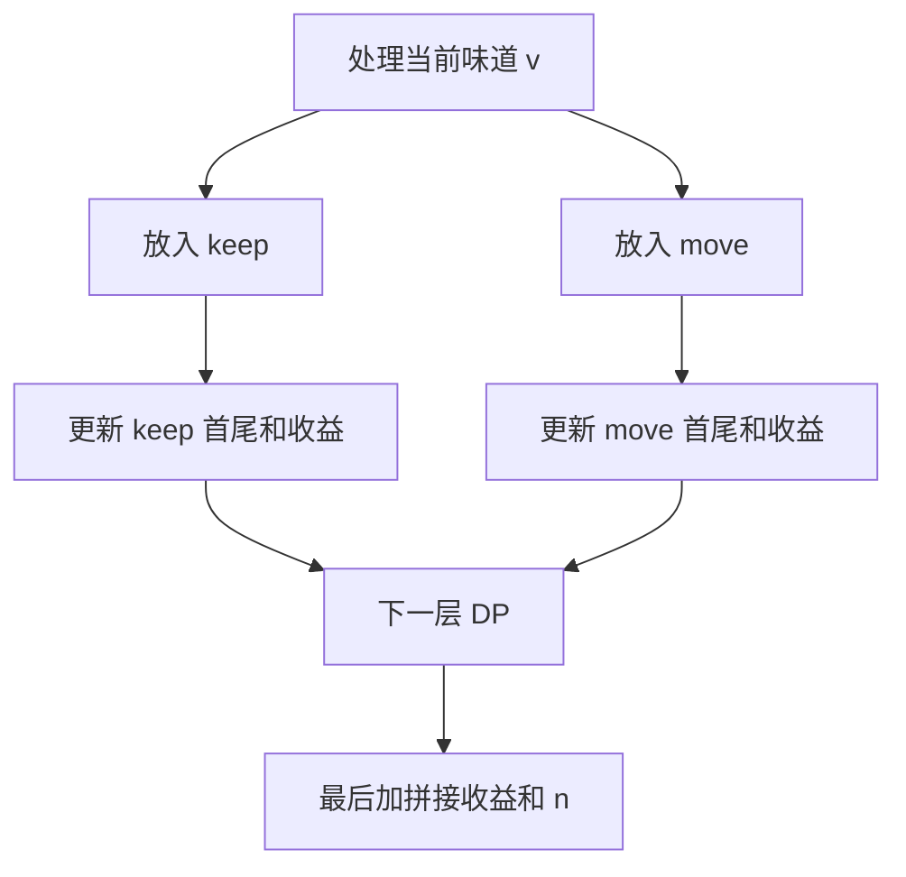
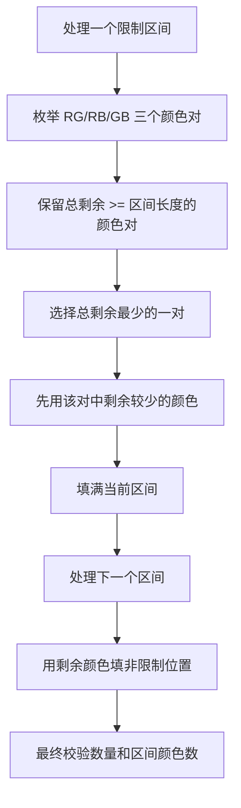
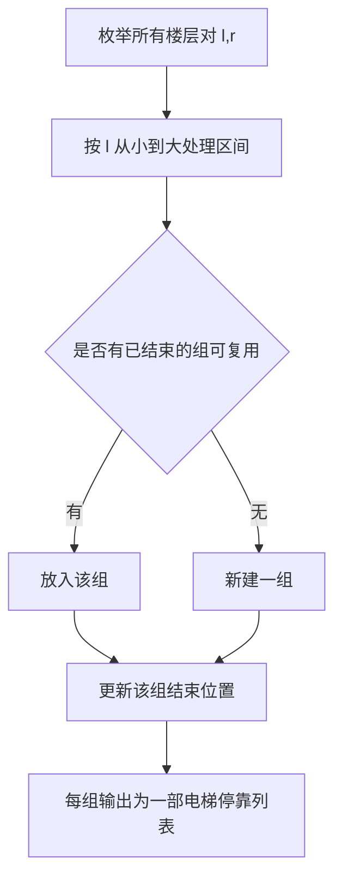
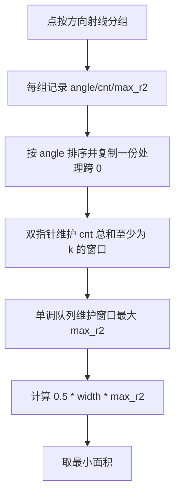
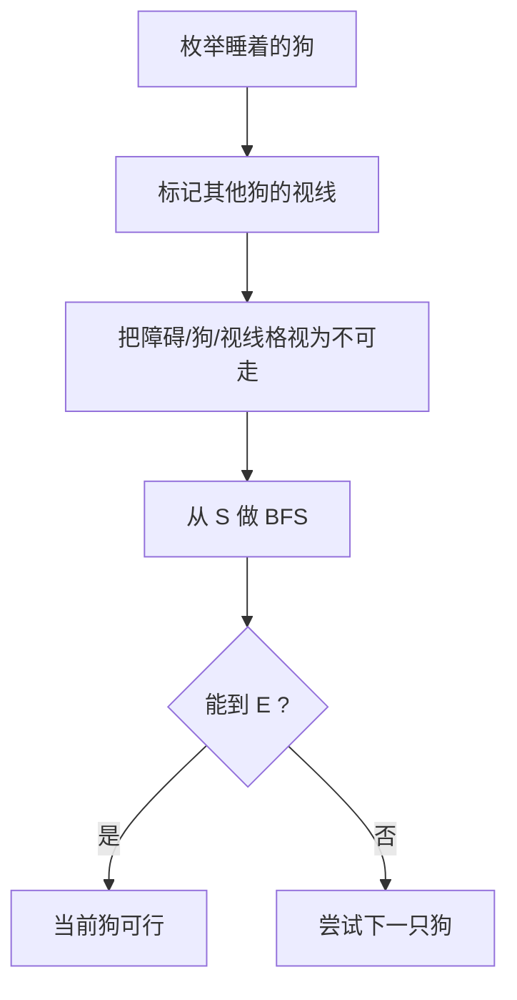
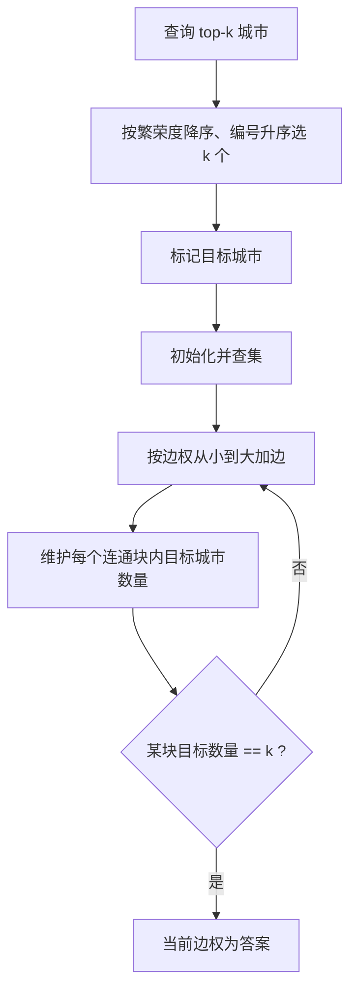

# HBCPC 完整通俗题解报告

本文档根据当前仓库 `problems/` 与 `solutions/` 中的题面和参考实现整理，目标是把每道题讲成可以复现的题解，而不是只给结论。

每题包含：

- 题意重述
- 思路图或流程图
- 核心观察
- 详细算法步骤
- 带注释核心代码
- 代码逻辑解析
- 复杂度与易错点

重要说明：本项目的题面、数据、标准解和报告均由 AI 根据题面反推生成，用于本地 OJ 练习、演示和验证。部分参考实现是面向本项目生成数据设计的，不等价于官方最强通用解。

## 源码索引与阅读方式

报告中的代码块采用“关键代码 + 注释 + 逐段解析”的形式，便于理解算法逻辑。完整未删减标准代码在 `solutions/` 目录中：

| 题号 | 标准代码 | 暴力/校验参考代码 |
| --- | --- | --- |
| A | `solutions/A/std.cpp` | `solutions/A/brute.cpp` |
| B | `solutions/B/std.cpp` | `solutions/B/brute.cpp` |
| C | `solutions/C/std.cpp` | `solutions/C/brute.cpp` |
| D | `solutions/D/std.cpp` | `solutions/D/brute.cpp` |
| E | `solutions/E/std.cpp` | `solutions/E/brute.cpp`, `checker/E/validator.cpp` |
| F | `solutions/F/std.cpp` | `solutions/F/brute.cpp`, `checker/F/interactor.cpp` |
| G | `solutions/G/std.cpp` | `solutions/G/brute.cpp` |
| H | `solutions/H/std.cpp` | `solutions/H/brute.cpp` |
| I | `solutions/I/std.cpp` | `solutions/I/brute.cpp` |
| J | `solutions/J/std.cpp` | `solutions/J/brute.cpp` |
| K | `solutions/K/std.cpp` | `solutions/K/brute.cpp`, `checker/K/validator.cpp` |
| L | `solutions/L/std.cpp` | `solutions/L/brute.cpp`, `checker/L/checker.cpp` |
| M | `solutions/M/std.cpp` | `solutions/M/brute.cpp`, `checker/M/checker.cpp` |

## 难度顺序总览

| 顺序 | 题号 | 核心方法 | 难点 |
| --- | --- | --- | --- |
| 1 | B | 固定输出 | 注意输出内容完全一致 |
| 2 | I | 二分答案 | 判断函数单调 |
| 3 | H | 字符前缀计数 | 证明最长统计可以退化成单字符 |
| 4 | J | 单价/整打贪心 | 只需比较最多整打和少一打 |
| 5 | F | 交互式二进制询问 | 由返回值反推总 1 数 |
| 6 | A | 小状态动态规划 | 最终序列由两个保序子序列拼接 |
| 7 | K | 构造与校验 | 非交区间逐段消耗颜色 |
| 8 | E | 区间分组构造 | 把任意楼层对转成区间覆盖 |
| 9 | L | 极角排序和滑动窗口 | 环形角度与窗口最大半径 |
| 10 | M | 视线模拟和 BFS | 多解字典序与视线遮挡 |
| 11 | C | 树上距离查询 | 当前实现按数据结构分类 |
| 12 | G | top-k 城市连通阈值 | top-k 选择加 Kruskal 思路 |
| 13 | D | Z 函数、组合计数、NTT | 把前后缀选择合并为卷积 |

```mermaid
flowchart LR
    basic[基础题<br/>B I H J] --> construct[构造题<br/>E K M]
    construct --> graph[图与树<br/>C G]
    graph --> math[字符串计数<br/>D]
    basic --> dp[动态规划<br/>A]
    dp --> math
```

---

## 1. B 题：固定输出

### 题意重述

这道题没有输入，也没有计算过程。程序只需要输出题目要求的祝贺语句。

### 思路图



### 核心观察

这种题主要考察输出格式。只要字符串、空格、标点和换行完全一致即可。

### 带注释核心代码

```cpp
#include <bits/stdc++.h>
using namespace std;

int main() {
    cout << "Congratulations on the success of the 10th Hebei CPC and the 2026 CCPC National Invitational (Qinhuangdao)!\n";
    return 0;
}
```

### 代码解析

程序没有 `cin`，因为题目没有输入。`cout` 后面的字符串就是答案，最后的 `\n` 保证输出换行。

### 复杂度

时间复杂度 `O(1)`，空间复杂度 `O(1)`。

### 易错点

不要漏掉感叹号、括号、空格或最后换行。

---

## 2. I 题：山海关老冰糕

### 题意重述

有 `N` 条生产线，第 `i` 条生产线每生产一份冰糕需要 `t_i` 分钟。所有生产线可以同时工作，问至少需要多少分钟才能生产出不少于 `M` 份冰糕。

### 直观理解

如果给定一个时间 `T`：

```text
第 1 条线产量 floor(T / t1)
第 2 条线产量 floor(T / t2)
...
总产量 = sum floor(T / ti)
```

时间越长，总产量只会增加，不会减少，所以答案具有单调性。

### 思路图



### 核心观察

定义判断函数：

```text
check(T) = T 分钟内能否生产至少 M 份
```

如果 `check(T)` 为真，那么所有大于 `T` 的时间也都为真。因此可以二分最小可行时间。

### 详细算法

1. 读入 `N, M` 和所有生产时间 `t_i`。
2. 设置二分下界 `lo = 0`。
3. 设置二分上界 `hi = min(t_i) * M`，表示最快的生产线单独生产也一定能完成。
4. 每次取 `mid = (lo + hi) / 2`。
5. 计算 `made = sum(mid / t_i)`。
6. 如果 `made >= M`，说明 `mid` 足够，令 `hi = mid`。
7. 否则令 `lo = mid + 1`。
8. 当 `lo == hi` 时，输出答案。

### 带注释核心代码

```cpp
long long lo = 0;
long long hi = 1LL * (*min_element(t.begin(), t.end())) * m;

while (lo < hi) {
    long long mid = (lo + hi) / 2;
    long long made = 0;

    for (int x : t) {
        made += mid / x;

        // 防止 made 继续变大，也减少不必要计算。
        if (made >= m) break;
    }

    if (made >= m) {
        hi = mid;       // mid 已经可行，答案在左半边或就是 mid
    } else {
        lo = mid + 1;   // mid 不够，答案一定更大
    }
}

cout << lo << "\n";
```

### 代码逻辑解析

`hi` 必须足够大，否则答案可能被漏掉。选择最快生产线单独完成任务的时间是一个安全上界。

循环里只关心 `made` 是否达到 `M`，达到后立即 `break`，避免数据很大时无意义累加。

### 复杂度

时间复杂度 `O(N log(min(t_i) * M))`，空间复杂度 `O(N)`。

### 易错点

- `min(t_i) * M` 可能超过 `int`，必须用 `long long`。
- `made` 也必须用 `long long`。
- 二分写法要保证最后收敛到最小可行值。

---

## 3. H 题：可能是字符串签到题

### 题意重述

给一个字符串 `s`，多次询问区间 `[l, r]` 中，出现次数最多的子串出现了多少次。

### 关键反直觉点

题目说的是“子串”，看起来很像后缀数组、后缀自动机或哈希题。但这里答案其实等于区间内出现次数最多的字符次数。

原因是：任何长度大于 1 的子串，如果出现了 `cnt` 次，那么它的第一个字符也至少出现了 `cnt` 次。也就是说，长子串的出现次数不可能超过某个单字符的出现次数。

### 图示

```text
区间：a b a b a

子串 "ab" 出现 2 次
字符 'a' 出现 3 次

长子串出现次数 <= 它首字符出现次数
所以最优答案一定可以由单字符取得
```

### 思路图

```mermaid
flowchart TD
    A[预处理每个前缀中 26 个字母的次数] --> B[询问 l,r]
    B --> C[枚举 26 个字母]
    C --> D[次数 = pref[r][c] - pref[l-1][c]]
    D --> E[取最大值]
```

### 详细算法

1. 建立数组 `pref[i][c]`，表示前 `i` 个字符中，字母 `c` 出现了多少次。
2. 对每个位置 `i`：
   - 先复制 `pref[i-1]`
   - 再把当前字符计数加一
3. 对每次询问 `[l, r]`：
   - 枚举 26 个字母
   - 计算区间出现次数
   - 输出最大值

### 带注释核心代码

```cpp
vector<array<int, 26>> pref(n + 1);
pref[0].fill(0);

for (int i = 1; i <= n; i++) {
    pref[i] = pref[i - 1];          // 继承前一个前缀的计数
    pref[i][s[i - 1] - 'a']++;      // 加上当前位置字符
}

while (q--) {
    int l, r;
    cin >> l >> r;

    int ans = 0;
    for (int c = 0; c < 26; c++) {
        int cnt = pref[r][c] - pref[l - 1][c];
        ans = max(ans, cnt);
    }

    cout << ans << "\n";
}
```

### 代码逻辑解析

`pref[r][c]` 是 `1..r` 中字符 `c` 的数量，`pref[l-1][c]` 是 `1..l-1` 中字符 `c` 的数量，两者相减就是 `[l,r]` 中的数量。

由于每次只枚举 26 个小写字母，所以查询很快。

### 复杂度

预处理 `O(26n)`，单次查询 `O(26)`，空间复杂度 `O(26n)`。

### 易错点

- 字符串下标从 0 开始，题目区间从 1 开始。
- `pref[0]` 要初始化为全 0。
- 不要被“子串”两个字误导成复杂字符串题。

---

## 4. J 题：海鲜大排档点生蚝

### 题意重述

有 `N` 家摊位。第 `i` 家：

- 单买一个生蚝价格为 `A_i`
- 买一打 12 个价格为 `B_i`

你有 `M` 元，只能选一家摊位购买，可以混合买整打和单个。问最多能买多少个。如果多家并列，输出编号最小的摊位。

### 核心观察

对某一家摊位来说，有两种情况：

```text
如果 B >= 12A：
    一打不比 12 个单买便宜
    直接全买单个最优

如果 B < 12A：
    一打更便宜
    最优方案一定接近“尽量多买整打”
```

为什么只需要比较 `d` 打和 `d-1` 打？

设 `d = M / B`。如果整打划算，买更少的整打会释放更多钱买单个，但每少一打就损失 12 个，最多换来的单个收益不会无限扩大。参考实现比较“最多整打”和“少买一打”即可覆盖最优。

### 思路图



### 带注释核心代码

```cpp
long long best(long long A, long long B, long long M) {
    // 整打不划算，全部单买。
    if (B >= 12 * A) return M / A;

    long long d = M / B;        // 最多能买多少打
    long long rem = M - d * B;  // 买 d 打后剩余的钱

    long long ans = 12 * d + rem / A;

    // 少买一打，有可能让余钱多买出不少单个。
    if (d > 0) {
        ans = max(ans, 12 * (d - 1) + (rem + B) / A);
    }

    return ans;
}
```

### 主流程代码

```cpp
long long bestCnt = -1;
int bestId = 1;

for (int i = 1; i <= n; i++) {
    long long A, B;
    cin >> A >> B;

    long long cur = best(A, B, M);

    // 严格更大才更新。相等时保留更早出现的编号。
    if (cur > bestCnt) {
        bestCnt = cur;
        bestId = i;
    }
}

cout << bestCnt << " " << bestId << "\n";
```

### 复杂度

时间复杂度 `O(N)`，空间复杂度 `O(1)`。

### 易错点

- 价格和预算乘法要用 `long long`。
- 并列时不能更新编号，否则会丢失最小编号。
- `d=0` 时不能计算 `d-1` 打。

---

## 5. F 题：01 序列交互题

### 题意重述

隐藏一个长度为 `n` 的 01 序列，保证至少有一个 `1`。目标是求出 `1` 的总数 `S`。

一次询问可以选择一个位置集合 `I`，设集合内有 `x` 个 `1`，集合外有 `S-x` 个 `1`，评测机返回：

```text
x * (S - x)
```

最多允许 17 次询问。

### 核心思想

参考实现询问 17 个二进制位。第 `b` 次询问所有编号第 `b` 位为 1 的位置。

对于某个候选总数 `S`，每次返回值 `p` 都必须满足：

```text
p = x(S - x)
```

这是关于 `x` 的二次方程：

```text
x^2 - Sx + p = 0
```

它有整数解的必要条件是判别式：

```text
S^2 - 4p
```

必须是完全平方数，并且根的奇偶性正确。

### 思维导图



### 带注释核心代码

```cpp
vector<long long> res;

for (int b = 0; b < 17; b++) {
    vector<int> pos;

    // 选择编号第 b 位为 1 的位置。
    for (int i = 1; i <= n; i++) {
        if ((i >> b) & 1) pos.push_back(i);
    }

    // 交互协议要求 k 至少为 1。
    if (pos.empty()) pos.push_back(1);

    cout << "? " << pos.size();
    for (int x : pos) cout << ' ' << x;
    cout << endl;

    long long v;
    cin >> v;
    res.push_back(v);
}
```

### 反推答案代码

```cpp
int answer = 1;

for (int s = 1; s <= n; s++) {
    bool ok = true;

    for (long long p : res) {
        long long d = 1LL * s * s - 4 * p;

        if (d < 0) {
            ok = false;
            break;
        }

        long long rt = sqrt((long double)d);
        while (rt * rt < d) rt++;
        while (rt * rt > d) rt--;

        // 判别式不是平方数，或者根不是整数。
        if (rt * rt != d || ((s + rt) & 1)) {
            ok = false;
            break;
        }
    }

    if (ok) {
        answer = s;
        break;
    }
}

cout << "! " << answer << endl;
```

### 代码逻辑解析

`sqrt` 用浮点数得到初值后，代码用 `while` 微调，避免浮点误差导致平方数判断出错。

`(s + rt) & 1` 用来判断根：

```text
x = (S +/- sqrt(S^2 - 4p)) / 2
```

是否为整数。

### 复杂度

交互询问次数固定 17 次，本地计算 `O(17n)`，空间复杂度 `O(17)`。

### 易错点

- 交互题每次输出后要刷新缓冲区，`endl` 可以刷新。
- 询问集合不能为空。
- 当前仓库的本地数据把隐藏串放在 `.in` 中，`.ans` 直接记录 `1` 的个数，用于离线 OJ 展示。

---

## 6. A 题：求求你不要再摔薯片了

### 题意重述

有 `n` 包薯片，每包味道是 `1..5`。按原顺序处理每包薯片，可以选择：

- 留在前面
- 扔到最后

所有处理结束后，吃的顺序就是：

```text
没有扔的薯片子序列 + 被扔到最后的薯片子序列
```

两个子序列内部都保持原相对顺序。每吃一包有 1 点快乐值，连续吃味道 `x` 后再吃味道 `y`，额外获得 `(y - x + 5) mod 5`。求最大快乐值。

### 结构图

```text
原序列：  a1  a2  a3  a4  a5
选择：    留  扔  留  扔  留

最终吃法：
保留序列：a1  a3  a5
扔后序列：a2  a4
拼接后：  a1  a3  a5  a2  a4
```

### 核心观察

每个元素只能进入两个保序子序列之一。由于味道只有 5 种，我们不需要记录完整序列，只需要记录两个子序列的首尾味道。

为什么要记录首味道？

因为最后要把 `keep` 子序列和 `move` 子序列拼接起来，需要知道：

```text
keep 的最后一个味道 -> move 的第一个味道
```

### 状态设计

令状态：

```text
dp[fk][lk][fm][lm]
```

含义：

- `fk`：keep 子序列的第一个味道
- `lk`：keep 子序列的最后一个味道
- `fm`：move 子序列的第一个味道
- `lm`：move 子序列的最后一个味道

值表示目前已经获得的“额外快乐值”最大值。`0` 表示该子序列为空。

### 思路图



### 带注释核心代码

```cpp
static int gain(int x, int y) {
    return (y - x + 5) % 5;
}

static int enc(int a, int b, int c, int d) {
    return (((a * 6 + b) * 6 + c) * 6 + d);
}
```

`enc` 把四维状态压成一维下标，方便用数组存 DP。

```cpp
const long long NEG = -(1LL << 60);
vector<long long> dp(6 * 6 * 6 * 6, NEG), ndp(6 * 6 * 6 * 6, NEG);

dp[enc(0, 0, 0, 0)] = 0;

for (int v : a) {
    fill(ndp.begin(), ndp.end(), NEG);

    for (int fk = 0; fk <= 5; ++fk)
    for (int lk = 0; lk <= 5; ++lk)
    for (int fm = 0; fm <= 5; ++fm)
    for (int lm = 0; lm <= 5; ++lm) {
        long long cur = dp[enc(fk, lk, fm, lm)];
        if (cur == NEG) continue;

        // 选择 1：当前薯片留在 keep 子序列。
        if (fk == 0) {
            ndp[enc(v, v, fm, lm)] = max(ndp[enc(v, v, fm, lm)], cur);
        } else {
            ndp[enc(fk, v, fm, lm)] =
                max(ndp[enc(fk, v, fm, lm)], cur + gain(lk, v));
        }

        // 选择 2：当前薯片扔到最后，也就是进入 move 子序列。
        if (fm == 0) {
            ndp[enc(fk, lk, v, v)] = max(ndp[enc(fk, lk, v, v)], cur);
        } else {
            ndp[enc(fk, lk, fm, v)] =
                max(ndp[enc(fk, lk, fm, v)], cur + gain(lm, v));
        }
    }

    dp.swap(ndp);
}
```

### 结算代码

```cpp
long long best = 0;

for (int fk = 0; fk <= 5; ++fk)
for (int lk = 0; lk <= 5; ++lk)
for (int fm = 0; fm <= 5; ++fm)
for (int lm = 0; lm <= 5; ++lm) {
    long long cur = dp[enc(fk, lk, fm, lm)];
    if (cur < 0) continue;

    // 两个子序列都非空时，还要加拼接处的额外快乐值。
    if (fk && fm) cur += gain(lk, fm);

    best = max(best, cur);
}

cout << best + n << "\n";
```

### 复杂度

状态数 `6^4 = 1296`，时间复杂度 `O(n * 6^4)`，空间复杂度 `O(6^4)`。

### 易错点

- DP 只统计额外快乐值，最后要加上每包薯片基础的 `n` 点。
- 空子序列用 `0` 表示，味道是 `1..5`。
- 最后拼接收益不能忘。

---

## 7. K 题：灯带

### 题意重述

要构造长度为 `n` 的灯带，三种颜色 `R/G/B` 的数量分别固定为 `r/g/b`。给出若干互不相交的区间，每个区间内最多只能出现两种颜色。要求构造方案，或者输出 `-1`。

### 当前参考实现的构造思想

因为限制区间互不相交，所以每个受限区间可以单独处理。对一个长度为 `len` 的区间，只要选两种颜色，它们剩余数量之和不少于 `len`，就能填满这个区间。

根据前一轮修复后的思路，应优先选择：

```text
剩余总数最少但仍能填满当前区间的一对颜色
```

然后在这一对颜色中优先使用剩余数量较少的颜色。这样可以尽量把稀缺颜色先消耗掉，让后续剩余颜色更集中，降低后面区间无法用两色填满的风险。

### 图示

```text
颜色剩余：
R = 2, G = 7, B = 9

当前区间长度 len = 5

可选颜色对：
R+G = 9
R+B = 11
G+B = 16

优先选择 R+G，因为它是能填满 len 的最小总量。
区间内再优先用较少的 R。
```

### 思路图



### 带注释核心代码

```cpp
for (auto [l, r] : seg) {
    int len = r - l + 1;

    vector<pair<pair<int, int>, pair<int, int>>> cand;

    // 枚举三种颜色对。
    for (int a = 0; a < 3; a++) {
        for (int b = a + 1; b < 3; b++) {
            if (rem[a] + rem[b] >= len) {
                // 第一关键字：两色剩余总量越小越优。
                // 第二关键字：max 剩余越小，颜色分布越均衡。
                cand.push_back({{rem[a] + rem[b], max(rem[a], rem[b])}, {a, b}});
            }
        }
    }

    if (cand.empty()) {
        ok = false;
        break;
    }

    sort(cand.begin(), cand.end());

    vector<int> use = {cand[0].second.first, cand[0].second.second};

    // 区间内先消耗剩余较少的颜色。
    sort(use.begin(), use.end(), [&](int a, int b) {
        return rem[a] < rem[b];
    });

    for (int i = l; i <= r; i++) {
        int c = rem[use[0]] > 0 ? use[0] : use[1];
        ans[i] = ch[c];
        rem[c]--;
    }
}
```

### 补齐非限制位置

```cpp
for (int i = 0; i < n; i++) {
    if (ans[i] == '?') {
        int c = max_element(rem.begin(), rem.end()) - rem.begin();

        if (rem[c] <= 0) {
            ok = false;
            break;
        }

        ans[i] = ch[c];
        rem[c]--;
    }
}
```

### 最终校验

```cpp
for (int c = 0; c < 3; c++) {
    if (rem[c] != 0) ok = false;
}

for (auto [l, r] : seg) {
    set<char> s;
    for (int i = l; i <= r; i++) s.insert(ans[i]);
    if (s.size() > 2) ok = false;
}
```

### 代码逻辑解析

构造题不能只“看起来能填”，还要在输出前重新检查：

- 长度是否为 `n`
- 三色数量是否完全匹配
- 每个限制区间内颜色种类是否不超过 2

这也是当前实现最后进行校验的原因。

### 复杂度

每个位置只填一次，每个区间只枚举 3 个颜色对。时间复杂度 `O(n + m)`，空间复杂度 `O(n)`。

### 易错点

- 原先如果优先使用数量最多的颜色，可能让后面区间剩余颜色过散或过少。
- 区间输入是 1 下标，程序内部转成 0 下标。
- 输出 `-1` 时不要再输出多余字符。

---

## 8. E 题：电梯

### 题意重述

有 `n` 层楼，需要建若干电梯。每部电梯都必须停靠第 1 层和第 `n` 层，也可以停靠中间若干层。要求任意两层 `x,y` 都能由某一部电梯直接到达，也就是这部电梯的停靠列表中同时包含 `x` 和 `y`。目标是最小化电梯数量 `m`，同时总停靠层数不超过限制。

### 转化

任意楼层对 `(l,r)` 都需要被某一部电梯覆盖。

如果一部电梯的停靠层列表是：

```text
1, 3, 5, 7, n
```

那么它覆盖所有相邻停靠点之间的直达段：

```text
(1,3), (3,5), (5,7), (7,n)
```

当前构造把所有需要覆盖的楼层对看成区间，然后把区间分组。每一组构造成一部电梯。

### 思路图



### 核心结论

参考实现输出的电梯数量为：

```text
floor(n/2) * ceil(n/2)
```

校验器也会检查这个数量是否符合预期。

### 带注释核心代码

```cpp
vector<vector<pair<int, int>>> byColor;

// 小根堆记录当前可复用组：(当前组最后区间右端点, 组编号)
priority_queue<pair<int, int>,
               vector<pair<int, int>>,
               greater<pair<int, int>>> pq;

for (int l = 1; l <= n; l++) {
    for (int r = l + 1; r <= n; r++) {
        int c;

        // 如果某组的最后右端点 <= 当前 l，就可以接上新区间。
        if (!pq.empty() && pq.top().first <= l) {
            c = pq.top().second;
            pq.pop();
        } else {
            c = byColor.size();
            byColor.push_back({});
        }

        byColor[c].push_back({l, r});
        pq.push({r, c});
    }
}
```

### 输出构造代码

```cpp
cout << byColor.size() << "\n";

for (auto &vec : byColor) {
    vector<int> stops;
    stops.push_back(1);

    for (auto [l, r] : vec) {
        if (stops.back() != l) stops.push_back(l);
        if (stops.back() != r) stops.push_back(r);
    }

    if (stops.back() != n) stops.push_back(n);

    for (size_t i = 0; i < stops.size(); ++i) {
        if (i) cout << ' ';
        cout << stops[i];
    }
    cout << "\n";
}
```

### 代码逻辑解析

这个过程类似经典的“区间图染色”：

- 两个区间如果会发生冲突，就不能放在同一组。
- 如果前一个区间已经在当前区间开始前结束，就可以复用同一组。
- 小根堆总是优先复用最早结束的组。

### 复杂度

楼层对数量是 `O(n^2)`。时间复杂度 `O(n^2 log n)`，空间复杂度 `O(n^2)`。由于 `n <= 1000`，在本项目数据范围内可接受。

### 易错点

- 每部电梯必须包含 1 和 `n`。
- 停靠层必须严格递增。
- 输出总停靠层数不能超过限制。

---

## 9. L 题：贪吃蛇

### 题意重述

蛇在原点。平面上有 `n` 个食物点。蛇选择一个角度区间 `[alpha, beta]`，形成一个扇形，并把该角度区间内的所有食物吃掉。要求至少吃掉 `k` 个食物，最小化扇形面积。

扇形面积：

```text
area = 1/2 * 角度宽度 * 半径^2
```

### 几何转化

修复后的实现先按“方向射线”分组，而不是直接按单个点滑窗。

原因是：如果多个食物和原点在同一条射线上，那么任意包含该方向的角度区间都会同时包含这些食物，不能只吃其中距离较近的几个。因此每个方向组需要记录：

- 极角 `angle`
- 该方向上食物数量 `cnt`
- 该方向上最大距离平方 `max_r2`

如果选择了按极角连续的一段方向组，那么：

```text
角度宽度 = 最右点角度 - 最左点角度
吃到的食物数量 = 这些方向组 cnt 之和
半径平方 = 这些方向组中最大的 max_r2
```

### 环形角度图示

```text
角度是一个圆：

0 ------------------ 2pi
|                     |
同一个方向在 0 和 2pi 处相接

为处理跨 0 的窗口：
复制一份角度数组，第二份整体加 2pi。
```

### 思路图



### 带注释核心代码

```cpp
const long double PI = acosl(-1.0L);

struct Group {
    long double ang;
    long double r2;
    int cnt;
};

map<pair<long long, long long>, Group> mp;

for (int i = 0; i < n; i++) {
    long long x, y;
    cin >> x >> y;

    // 用约分后的方向向量作为 key，保证同一射线上的点被分到同一组。
    long long g = gcd(llabs(x), llabs(y));
    pair<long long, long long> key = {x / g, y / g};

    long double ang = atan2l((long double)y, (long double)x);
    if (ang < 0) ang += 2 * PI;

    long double r2 = (long double)x * x + (long double)y * y;

    auto &grp = mp[key];
    if (grp.cnt == 0) {
        grp.ang = ang;
        grp.r2 = r2;
    } else {
        grp.r2 = max(grp.r2, r2);
    }
    grp.cnt++;
}
```

同一方向上的多个点会被同一个角度边界同时包含，所以只保留该方向的最大 `r2`。

### 滑动窗口代码

```cpp
vector<Group> a;
for (auto &kv : mp) a.push_back(kv.second);

sort(a.begin(), a.end(), [](const Group &x, const Group &y) {
    return x.ang < y.ang;
});

int g = a.size();
deque<int> dq;
int r = 0;
int have = 0;
long double best = 1e100L;

auto angle_at = [&](int idx) {
    return a[idx % g].ang + (idx >= g ? 2 * PI : 0);
};
auto r2_at = [&](int idx) {
    return a[idx % g].r2;
};
auto cnt_at = [&](int idx) {
    return a[idx % g].cnt;
};

for (int l = 0; l < g; l++) {
    while (r < l + g && have < k) {
        while (!dq.empty() && r2_at(dq.back()) <= r2_at(r)) dq.pop_back();
        dq.push_back(r);
        have += cnt_at(r);
        r++;
    }

    if (have >= k) {
        long double width = angle_at(r - 1) - angle_at(l);
        best = min(best, 0.5L * width * r2_at(dq.front()));
    }

    have -= cnt_at(l);
    if (!dq.empty() && dq.front() == l) {
        dq.pop_front();
    }
}
```

### 代码逻辑解析

双指针维护一个方向窗口，使窗口中的食物数量至少为 `k`。对固定左端点，右端点越往右，角度宽度不会变小，窗口最大半径也不会变小，所以最早达到 `k` 的右端点就是该左端点下的最优选择。

单调队列中保存的是候选最大 `max_r2` 的方向组下标。队尾保持 `max_r2` 递减，队首就是当前窗口最大值。

通过 `idx % g` 和 `idx >= g ? 2pi : 0`，跨越 0 度的窗口会变成普通连续窗口。

### 复杂度

排序 `O(n log n)`，滑动窗口 `O(n)`，空间复杂度 `O(n)`。

### 易错点

- `atan2` 返回值可能为负，需要加 `2pi`。
- 同一射线上的点必须先压缩成一组，否则可能错误排除同角度远点。
- 输出需要足够精度。
- `k=1` 是特殊情况，答案为 0。

---

## 10. M 题：拯救猫猫

### 题意重述

网格中有：

- `S`：起点
- `E`：终点
- `#`：障碍
- `U/D/L/R`：朝固定方向看的狗
- `.`：空地

猫不能走进障碍、狗所在格，也不能走进任何狗的视线。你可以让一只狗睡着，它会失去视线，但所在格仍不能通过。问是否能让猫从 `S` 到 `E`。如果有多种方案，输出行列字典序最小的狗。

### 视线示意

```text
R . . # . .

狗朝右看：
R > > #     视线被 # 阻断

如果另一只狗在前方，也会阻断视线。
```

### 思路图



### 核心函数：判断某只狗睡着后是否可行

```cpp
auto can = [&](int sleep) -> bool {
    vector<vector<int>> seen(n, vector<int>(m, 0));

    // 标记所有没有睡着的狗的视线。
    for (int idx = 0; idx < (int)dogs.size(); ++idx) {
        if (idx == sleep) continue;

        auto [r, c] = dogs[idx];
        char d = grid[r][c];

        int nr = r + dr(d);
        int nc = c + dc(d);

        while (nr >= 0 && nr < n && nc >= 0 && nc < m &&
               grid[nr][nc] != '#' && !dog(grid[nr][nc])) {
            seen[nr][nc]++;
            nr += dr(d);
            nc += dc(d);
        }
    }

    auto freecell = [&](int r, int c) {
        if (r < 0 || r >= n || c < 0 || c >= m) return false;
        if (grid[r][c] == '#' || dog(grid[r][c]) || seen[r][c]) return false;
        return true;
    };

    if (!freecell(S.first, S.second) || !freecell(E.first, E.second)) {
        return false;
    }

    queue<pair<int, int>> q;
    vector<vector<char>> vis(n, vector<char>(m, 0));

    q.push(S);
    vis[S.first][S.second] = 1;

    int rr[4] = {1, -1, 0, 0};
    int cc[4] = {0, 0, 1, -1};

    while (!q.empty()) {
        auto [r, c] = q.front();
        q.pop();

        if (make_pair(r, c) == E) return true;

        for (int z = 0; z < 4; z++) {
            int nr = r + rr[z];
            int nc = c + cc[z];

            if (freecell(nr, nc) && !vis[nr][nc]) {
                vis[nr][nc] = 1;
                q.push({nr, nc});
            }
        }
    }

    return false;
};
```

### 输出策略

```cpp
if (can(-1)) {
    // 不需要任何狗睡着也能通过时，仍然要输出一只狗。
    // 当前实现输出扫描顺序中的第一只狗。
    cout << dogs[0].first + 1 << " " << dogs[0].second + 1 << "\n";
    continue;
}

pair<int, int> ans = {-1, -1};

for (int i = 0; i < (int)dogs.size(); i++) {
    if (can(i)) {
        ans = {dogs[i].first + 1, dogs[i].second + 1};
        break;
    }
}

cout << ans.first << " " << ans.second << "\n";
```

### 代码逻辑解析

扫描网格时狗按行列顺序加入 `dogs`，所以枚举 `dogs` 的顺序就是字典序。找到第一个可行狗即可输出。

### 复杂度

设狗数量为 `d`，网格大小为 `n*m`。直接枚举每只狗并重新标记视线和 BFS，复杂度约为 `O(d * n * m)`。当前参考实现优先保证逻辑清晰，适合本项目数据和教学展示。

### 易错点

- 睡着的狗失去视线，但它所在格仍然不能走。
- 狗的视线会被障碍或另一只狗阻断。
- 如果不需要睡狗也能通过，仍要输出一个合法狗坐标。

---

## 11. C 题：世界树

### 题意重述

给一棵带权树，多次询问两个点 `x,y`，求：

```text
max over all u: dis(x,u) + dis(y,u)
```

边权可以为负。

### 数学理解

对固定的 `x,y`，我们要找一个点 `u`，让它到 `x` 和 `y` 的距离和最大。

如果能快速得到所有点到 `x` 和 `y` 的距离，就可以直接枚举 `u`。难点在于 `n,q` 都可能很大。

### 当前参考实现策略

当前实现不是一份完整通用的最优大数据树算法，而是按本项目生成数据的结构分类处理：

```text
小树：预处理所有点对距离
链：用前缀距离和前缀最小/后缀最大回答
星形：枚举中心、x、y 和若干大权叶子候选
其他：单次查询 DFS
```

### 分类流程图

```mermaid
flowchart TD
    A[读入树] --> B{n <= 2200 ?}
    B -- 是 --> C[预处理任意两点距离]
    B -- 否 --> D{是否为链}
    D -- 是 --> E[前缀距离 O(1) 查询]
    D -- 否 --> F{是否为星形}
    F -- 是 --> G[枚举少量候选点]
    F -- 否 --> H[每次 DFS 计算]
```

### 小树处理代码

```cpp
if (n <= 2200) {
    vector<vector<long long>> dist(n + 1, vector<long long>(n + 1));

    for (int s = 1; s <= n; s++) {
        vector<int> st = {s}, par(n + 1, 0);
        par[s] = -1;

        while (!st.empty()) {
            int u = st.back();
            st.pop_back();

            for (auto [v, w] : g[u]) {
                if (v != par[u]) {
                    par[v] = u;
                    dist[s][v] = dist[s][u] + w;
                    st.push_back(v);
                }
            }
        }
    }

    while (q--) {
        int x, y;
        cin >> x >> y;

        long long ans = LLONG_MIN;
        for (int u = 1; u <= n; u++) {
            ans = max(ans, dist[x][u] + dist[y][u]);
        }

        cout << ans << "\n";
    }
}
```

### 链结构处理

如果树是 `1-2-3-...-n` 的链，可以把点的位置变成前缀距离 `pref[i]`。

对查询 `x,y`，设 `a=min(x,y), b=max(x,y)`，最优点可能在：

- `[a,b]` 内
- `a` 左侧
- `b` 右侧

参考实现用 `minPref` 和 `maxSuf` 快速得到左右两侧贡献。

```cpp
long long mid = pref[b] - pref[a];
long long left = pref[x] + pref[y] - 2 * minPref[a];
long long right = 2 * maxSuf[b] - pref[x] - pref[y];

cout << max({mid, left, right}) << "\n";
```

### 星形结构处理

星形树中，任意叶子之间距离只经过中心。最优 `u` 常出现在：

- 中心
- `x`
- `y`
- 权值最大的若干叶子

参考实现保留前 5 个大权叶子作为候选。

### 复杂度

- 小树：预处理 `O(n^2)`，查询 `O(n)`
- 链：预处理 `O(n)`，查询 `O(1)`
- 星形：预处理排序 `O(n log n)`，查询 `O(1)`
- 其他：单次查询 `O(n)`

### 易错点

- 边权可以为负，所以不能直接套“树直径端点”一类只适合非负边权的结论。
- 当前实现与本项目生成数据匹配。若要用于严格大规模任意树，需要设计更通用的数据结构或树 DP 查询方案。

---

## 12. G 题：建设高铁

### 题意重述

图中每条边有建设难度 `d`。如果买价格为 `V` 的设备，就能建设所有 `d <= V` 的边。

城市有繁荣度，支持两种操作：

1. 修改某个城市的繁荣度。
2. 查询当前繁荣度最高的 `k` 个城市，使它们连通所需的最小设备价格。

繁荣度相同则编号小的城市优先。

### 核心转化

对于已经选出的 `k` 个城市，要找最小 `V` 使它们在只保留 `d <= V` 的边后连通。

这等价于：

```text
按边权从小到大加入边。
第一次让这 k 个点位于同一个连通块时，当前边权就是答案。
```

这就是 Kruskal 的瓶颈连通思想。

### 思路图



### top-k 选择代码

```cpp
vector<int> id(n);
iota(id.begin(), id.end(), 1);

auto cmp = [&](int x, int y) {
    if (a[x] != a[y]) return a[x] > a[y]; // 繁荣度高优先
    return x < y;                         // 编号小优先
};

// 当前参考实现使用 nth_element 选出前 k 个。
// 工程上需要注意：k == n 时不应把 nth 设为 end。
if (k < n) {
    nth_element(id.begin(), id.begin() + k, id.end(), cmp);
}

id.resize(k);
```

### 并查集代码

```cpp
struct DSU {
    vector<int> p, sz, cnt;

    DSU(int n = 0) { init(n); }

    void init(int n) {
        p.resize(n + 1);
        sz.assign(n + 1, 1);
        cnt.assign(n + 1, 0);
        iota(p.begin(), p.end(), 0);
    }

    int find(int x) {
        while (p[x] != x) x = p[x] = p[p[x]];
        return x;
    }

    int unite(int a, int b) {
        a = find(a);
        b = find(b);
        if (a == b) return a;

        if (sz[a] < sz[b]) swap(a, b);
        p[b] = a;
        sz[a] += sz[b];
        cnt[a] += cnt[b];
        return a;
    }
};
```

### 查询代码

```cpp
vector<char> sel(n + 1, 0);
for (int x : id) sel[x] = 1;

if (k <= 1) {
    cout << 0 << "\n";
    continue;
}

DSU dsu(n);
for (int i = 1; i <= n; i++) {
    dsu.cnt[i] = sel[i];
}

int ans = 0;

for (auto &e : edges) {
    int r = dsu.unite(e.u, e.v);

    if (dsu.cnt[dsu.find(r)] == k) {
        ans = e.d;
        break;
    }
}

cout << ans << "\n";
```

### 代码逻辑解析

`cnt[root]` 表示某个连通块里有多少个被选中的目标城市。每合并一次连通块，就把目标数量相加。当某个块的目标数量达到 `k`，说明所有目标城市第一次连通，当前边权就是最小设备价格。

### 复杂度

当前参考实现每次普通查询会重新选择 top-k 并重跑并查集，复杂度约为：

```text
O(n + m alpha(n))
```

大规模数据中如果查询都为 `k=1`，可以直接输出 `0`，参考实现对此做了快速处理。

### 易错点

- `k=1` 答案一定是 0。
- top-k 的平局规则是编号小优先。
- `nth_element` 在 `k == n` 时需要特殊处理，不能传入 `begin()+k` 作为 `nth`。
- 当前实现是教学和本项目数据适配版本，不是面向所有极限 `n,m,q=5e5` 的高性能通用解。

---

## 13. D 题：简单字符串题

### 题意重述

给字符串 `S` 和整数 `k`，统计把 `S` 写成：

```text
S = A^i B1 B2 ... Bk C^j
```

的方案数。这里：

- `A` 和 `C` 是非空字符串
- `i,j` 是正整数
- `B1..Bk` 是 `k` 个非空字符串
- 不同方案按字符串和指数是否相同区分

答案对 `998244353` 取模。

### 分解思路

先决定：

```text
左边 A^i 的总长度 = p
右边 C^j 的总长度 = q
中间长度 = n - p - q
```

如果知道：

- `pref[p]`：前 `p` 个字符能写成多少种 `A^i`
- `suf[q]`：后 `q` 个字符能写成多少种 `C^j`

那么固定 `p,q` 的贡献就是：

```text
pref[p] * suf[q] * 中间切成 k 段的方案数
```

### 中间部分怎么计数

长度为 `mid` 的字符串切成 `k` 个非空连续段，等价于在 `mid-1` 个缝隙中选 `k-1` 个切口：

```text
C(mid - 1, k - 1)
```

如果 `k=0`，中间必须为空，即 `p+q=n`。

### 大图

```text
S = [        前缀 p        ][   中间 mid   ][        后缀 q        ]
    [A A A ... A]           [B1 B2 ... Bk]  [C C C ... C]

贡献：
前缀重复表示数 * 后缀重复表示数 * 中间切分数
```

### 思路图

```mermaid
flowchart TD
    A[计算每个前缀长度 p 的重复表示数 pref[p]] --> B[反转字符串]
    B --> C[计算每个后缀长度 q 的重复表示数 suf[q]]
    C --> D[用 NTT 卷积合并 p+q=t]
    D --> E{k == 0 ?}
    E -- 是 --> F[答案 = h[n]]
    E -- 否 --> G[枚举 t<br/>贡献 h[t] * C(n-t-1,k-1)]
```

### Z 函数用途

对字符串 `s`，`z[i]` 表示从 `i` 开始的后缀和整个字符串前缀的最长公共前缀长度。

如果某个循环节长度为 `len`，那么从位置 `len` 开始应该和开头匹配很长一段。参考实现用 Z 函数快速统计每个前缀长度可由多少种循环节组成。

### 统计重复表示数代码

```cpp
vector<int> zfunc(const string &s) {
    int n = s.size();
    vector<int> z(n);
    z[0] = n;

    for (int i = 1, l = 0, r = 0; i < n; i++) {
        if (i <= r) z[i] = min(r - i + 1, z[i - l]);

        while (i + z[i] < n && s[z[i]] == s[i + z[i]]) z[i]++;

        if (i + z[i] - 1 > r) {
            l = i;
            r = i + z[i] - 1;
        }
    }

    return z;
}
```

```cpp
vector<int> period_counts(const string &s) {
    int n = s.size();
    auto z = zfunc(s);
    vector<int> cnt(n + 1);

    for (int len = 1; len <= n; ++len) {
        int lim = (len == n) ? n : min(n, len + z[len]);

        // 所有 len 的倍数 p，只要 p <= lim，就能由长度 len 的循环节组成。
        for (int p = len; p <= lim; p += len) {
            cnt[p]++;
        }
    }

    return cnt;
}
```

### 为什么要 NTT

直接枚举 `p,q` 是 `O(n^2)`。但我们只关心 `p+q=t` 的总贡献：

```text
h[t] = sum pref[p] * suf[q], where p + q = t
```

这正是卷积。

### 卷积代码框架

```cpp
vector<int> conv(vector<int> a, vector<int> b) {
    int need = a.size() + b.size() - 1;
    int n = 1;
    while (n < need) n <<= 1;

    a.resize(n);
    b.resize(n);

    ntt(a, false);
    ntt(b, false);

    for (int i = 0; i < n; i++) {
        a[i] = (long long)a[i] * b[i] % MOD;
    }

    ntt(a, true);
    a.resize(need);
    return a;
}
```

### 最终累加代码

```cpp
vector<int> pref = period_counts(s);

reverse(s.begin(), s.end());
vector<int> suf = period_counts(s);

vector<int> h = conv(pref, suf);

long long ans = 0;

if (k == 0) {
    if (n < (int)h.size()) ans = h[n];
} else {
    for (int t = 2; t <= n - k && t < (int)h.size(); ++t) {
        ans = (ans + (long long)h[t] * C(n - t - 1, k - 1)) % MOD;
    }
}

cout << ans % MOD << "\n";
```

### 代码逻辑解析

`t = p + q`。前缀和后缀都非空，所以 `t` 至少为 2。中间长度是 `n-t`，要切成 `k` 个非空块，所以要求 `n-t >= k`。

当 `k=0` 时没有中间块，必须 `p+q=n`。

### 复杂度

Z 函数和循环统计约 `O(n log n)` 级别，NTT 为 `O(n log n)`，组合数预处理 `O(n)`。整体为 `O(n log n)`。

### 易错点

- `k=0` 要单独处理。
- 前缀和后缀都必须非空。
- 组合数 `C(n-t-1,k-1)` 中的参数不能写反。
- 模数 `998244353` 支持 NTT，原根为 3。

---

## 附录：阅读代码时的推荐顺序

如果你是第一次读这套参考实现，建议按下面顺序阅读：

1. `solutions/B/std.cpp`
2. `solutions/I/std.cpp`
3. `solutions/H/std.cpp`
4. `solutions/J/std.cpp`
5. `solutions/A/std.cpp`
6. `solutions/K/std.cpp`
7. `solutions/E/std.cpp`
8. `solutions/L/std.cpp`
9. `solutions/M/std.cpp`
10. `solutions/C/std.cpp`
11. `solutions/G/std.cpp`
12. `solutions/D/std.cpp`

这个顺序从基本语法和简单贪心开始，逐步过渡到构造、图论、几何和字符串计数。

## 附录：报告与源码的关系

本文档解释的是当前仓库参考实现的设计思路。若后续修改 `solutions/` 中的标准代码，应同步更新本文档中的：

- 核心观察
- 关键代码片段
- 复杂度说明
- 易错点说明

这样可以保证题解、数据、标准解和本地 OJ 展示始终一致。
